## Load Required R Libraries

```r
library(repmis)
```

```
## Warning: package 'repmis' was built under R version 3.4.2
```

```r
library(dplyr)
```

```
## Warning: package 'dplyr' was built under R version 3.4.2
```

```
## 
## Attaching package: 'dplyr'
```

```
## The following objects are masked from 'package:stats':
## 
##     filter, lag
```

```
## The following objects are masked from 'package:base':
## 
##     intersect, setdiff, setequal, union
```

```r
library(tidyverse)
```

```
## Warning: package 'tidyverse' was built under R version 3.4.2
```

```
## -- Attaching packages ---------------------------------- tidyverse 1.2.1 --
```

```
## v ggplot2 2.2.1     v readr   1.1.1
## v tibble  1.3.4     v purrr   0.2.4
## v tidyr   0.7.2     v stringr 1.2.0
## v ggplot2 2.2.1     v forcats 0.2.0
```

```
## Warning: package 'ggplot2' was built under R version 3.4.2
```

```
## Warning: package 'tibble' was built under R version 3.4.2
```

```
## Warning: package 'tidyr' was built under R version 3.4.2
```

```
## Warning: package 'readr' was built under R version 3.4.2
```

```
## Warning: package 'purrr' was built under R version 3.4.2
```

```
## Warning: package 'stringr' was built under R version 3.4.2
```

```
## Warning: package 'forcats' was built under R version 3.4.2
```

```
## -- Conflicts ------------------------------------- tidyverse_conflicts() --
## x dplyr::filter() masks stats::filter()
## x dplyr::lag()    masks stats::lag()
```

```r
library(tidyr)
library(ggplot2)
library(sqldf)
```

```
## Warning: package 'sqldf' was built under R version 3.4.2
```

```
## Loading required package: gsubfn
```

```
## Warning: package 'gsubfn' was built under R version 3.4.2
```

```
## Loading required package: proto
```

```
## Warning: package 'proto' was built under R version 3.4.2
```

```
## Loading required package: RSQLite
```

```r
library(kimisc)
```

```
## Warning: package 'kimisc' was built under R version 3.4.2
```

```r
library(XML)
library(RCurl)
```

```
## Loading required package: bitops
```

```
## 
## Attaching package: 'RCurl'
```

```
## The following object is masked from 'package:tidyr':
## 
##     complete
```

```r
library(rvest)
```

```
## Warning: package 'rvest' was built under R version 3.4.2
```

```
## Loading required package: xml2
```

```
## Warning: package 'xml2' was built under R version 3.4.2
```

```
## 
## Attaching package: 'rvest'
```

```
## The following object is masked from 'package:XML':
## 
##     xml
```

```
## The following object is masked from 'package:purrr':
## 
##     pluck
```

```
## The following object is masked from 'package:readr':
## 
##     guess_encoding
```

```r
library(plyr)
```

```
## Warning: package 'plyr' was built under R version 3.4.2
```

```
## -------------------------------------------------------------------------
```

```
## You have loaded plyr after dplyr - this is likely to cause problems.
## If you need functions from both plyr and dplyr, please load plyr first, then dplyr:
## library(plyr); library(dplyr)
```

```
## -------------------------------------------------------------------------
```

```
## 
## Attaching package: 'plyr'
```

```
## The following object is masked from 'package:purrr':
## 
##     compact
```

```
## The following objects are masked from 'package:dplyr':
## 
##     arrange, count, desc, failwith, id, mutate, rename, summarise,
##     summarize
```

```r
library(pastecs)
```

```
## Warning: package 'pastecs' was built under R version 3.4.3
```

```
## Loading required package: boot
```

```
## 
## Attaching package: 'pastecs'
```

```
## The following object is masked from 'package:tidyr':
## 
##     extract
```

```
## The following objects are masked from 'package:dplyr':
## 
##     first, last
```

## R - environment List of libraries used by the session

```r
sessionInfo()
```

```
## R version 3.4.1 (2017-06-30)
## Platform: x86_64-w64-mingw32/x64 (64-bit)
## Running under: Windows 10 x64 (build 15063)
## 
## Matrix products: default
## 
## locale:
## [1] LC_COLLATE=English_United States.1252 
## [2] LC_CTYPE=English_United States.1252   
## [3] LC_MONETARY=English_United States.1252
## [4] LC_NUMERIC=C                          
## [5] LC_TIME=English_United States.1252    
## 
## attached base packages:
## [1] stats     graphics  grDevices utils     datasets  methods   base     
## 
## other attached packages:
##  [1] pastecs_1.3-18  boot_1.3-19     plyr_1.8.4      rvest_0.3.2    
##  [5] xml2_1.1.1      RCurl_1.95-4.8  bitops_1.0-6    XML_3.98-1.9   
##  [9] kimisc_0.3      sqldf_0.4-11    RSQLite_2.0     gsubfn_0.6-6   
## [13] proto_1.0.0     forcats_0.2.0   stringr_1.2.0   purrr_0.2.4    
## [17] readr_1.1.1     tidyr_0.7.2     tibble_1.3.4    ggplot2_2.2.1  
## [21] tidyverse_1.2.1 dplyr_0.7.4     repmis_0.5     
## 
## loaded via a namespace (and not attached):
##  [1] Rcpp_0.12.13        lubridate_1.7.1     lattice_0.20-35    
##  [4] assertthat_0.2.0    rprojroot_1.2       digest_0.6.12      
##  [7] psych_1.7.8         R6_2.2.2            cellranger_1.1.0   
## [10] chron_2.3-51        backports_1.1.1     evaluate_0.10.1    
## [13] httr_1.3.1          rlang_0.1.4         lazyeval_0.2.1     
## [16] readxl_1.0.0        rstudioapi_0.7      data.table_1.10.4-3
## [19] blob_1.1.0          R.utils_2.6.0       R.oo_1.21.0        
## [22] rmarkdown_1.8.3     foreign_0.8-69      bit_1.1-12         
## [25] munsell_0.4.3       broom_0.4.3         compiler_3.4.1     
## [28] modelr_0.1.1        pkgconfig_2.0.1     mnormt_1.5-5       
## [31] htmltools_0.3.6     tcltk_3.4.1         crayon_1.3.4       
## [34] R.methodsS3_1.7.1   grid_3.4.1          nlme_3.1-131       
## [37] jsonlite_1.5        gtable_0.2.0        DBI_0.7            
## [40] magrittr_1.5        scales_0.5.0        cli_1.0.0          
## [43] stringi_1.1.6       reshape2_1.4.2      bindrcpp_0.2       
## [46] tools_3.4.1         bit64_0.9-7         R.cache_0.12.0     
## [49] glue_1.2.0          hms_0.4.0           parallel_3.4.1     
## [52] yaml_2.1.15         colorspace_1.3-2    memoise_1.1.0      
## [55] knitr_1.17          bindr_0.1           haven_1.1.0
```

## Set Base Directory:


```r
# Executing from Vivek's System:
BaseDir <- "C:/Vivek/Data_Science/MSDS6306-DoingDataScience/Case_Study_2/MSDS6306_CaseStudy_2/"

# Executing from Megan's System:
# BaseDir <- "/Users/megandiane/Desktop/DDS_Class/Case_Study_2/MSDS6306_CaseStudy_2"
```

## Set Other Working Directories and File Path

```r
DataDir <- paste(BaseDir,"Data", sep = "/")
CodeDir <- paste(BaseDir,"Code", sep = "/")
PresenatationDir <- paste(BaseDir,"Presentation", sep = "/")

ProcrastinationDataFile <- paste(DataDir, "Procrastination.csv", sep = "/")
```

## Read the Data File

```r
ProcrastinationData <- read.csv(ProcrastinationDataFile, sep = ",", header = T, na.strings = "")
```

# Assign Column Names

```r
names(ProcrastinationData) <- c("Age", "Gender", "Kids", "Education", "WorkStatus", 
                                "AnnualIncome", "CurrOccption", "PostHeldYrs", "PostHeldMths", 
                                "CmmuntySize", "CntryResdnc", "MaritlStatus", "SonsCnt", 
                                "DaughtersCnt", "D1DsnTmeWst", "D2DelayActn", "D3HesitatDsn", 
                                "D4DelayDsn", "D5PutoffDsn", "A1BillsOnTm", "A2OnTm4Appt", 
                                "A3Rdy4NxtDy", "A4RuningLate", "A5ActvtDlyd", "A6TmeMgmtTrg", 
                                "A7FrndsOpn", "A8ImpTskOnTm", "A9MissDedlns", "A10RnOutOfTm", 
                                "A11DrAptOnTm", "A12MorPnctul", "A13RtneMntnc", "A14SchdulLte", 
                                "A15DldActCst", "G1LteToTsk", "G2LteTktPrch", "G3PlnPrtyAhd", 
                                "G4GetUpOnTme", "G5PstLtrOnTm", "G6RtrnCalls", "G7DlyEsyTsks", 
                                "G8PrmptDscsn", "G9DlyTskStrt", "G10TrvlRsh", "G11RdyOnTme", 
                                "G12StayOnTsk", "G13SmlBlOnTm", "G14PrmptRSVP", "G15TskCmpErl", 
                                "G16LstMntGft", "G17DlyEsntPr", "G18DyTskCmpl", "G19PshTskTmr", 
                                "G20CmpTskRlx", "S1LfClsI2dl", "S2LfCndExlnt", "S3StsfdWtLf", 
                                "S4GtImThgsLf", "S5LvAgChgNth", "CnsdrSlfProc", "OthCsndrProc")
```

#### The data file has been read and stored in a temporary data frame (ProcrastinationData). The column names have been standardized to be 12 characters long or lesser.
#### The Column name mapping between the source csv file and the data frame can be found at the below path:
#### https://github.com/vviswanathan/MSDS6306_CaseStudy_2/blob/master/Presentation/Procrastination_Column_Name_Mapping.csv


```r
dim(ProcrastinationData)
```

```
## [1] 4264   61
```

# To Clean up the data from Procrastination.csv we took the "Male" and "Female" that we found under the Column of "Sons" and
# replaced it with the correct response of 1 = Male and 2 = Female.

```r
levels(ProcrastinationData$SonsCnt) <- c(levels(ProcrastinationData$SonsCnt), "1", "2")
ProcrastinationData$SonsCnt[ProcrastinationData$SonsCnt=='Male'] <- '1'
ProcrastinationData$SonsCnt[ProcrastinationData$SonsCnt=='Female'] <- '2'

ProcrastinationData[,"SonsCnt"] <- as.integer(as.character(ProcrastinationData[,"SonsCnt"]))
ProcrastinationData[,"PostHeldYrs"] <- as.integer(ProcrastinationData[,"PostHeldYrs"])
```

#To Clean up the data from Procrastination.csv we did the folowing:
#1. If Annual Income was blank, we filled with a -0.01, that way we could easily differentiate from true data, and keep as a numerical data type 
#2. If the Country of Residence was filled with a "0", we filled with "Missing", to keep as a character data type
#3. If Current Occupation was filled with "0" or "please specify", we filled with "Missing", to keep as a character data type

#4. For all of the Procrastination Scales: DP, AIP, GP, and SWLS, the means were taken and columns added to reflect those means.
#   This Mean data is to be used later on.

```r
ProcTrans <- ProcrastinationData %>% 
  mutate(AnnualIncome=replace(AnnualIncome, is.na(AnnualIncome), -0.01)) %>%
  mutate_if(is.numeric, funs(ifelse(is.na(.), 0, .))) %>% 
  mutate_if(is.character, funs(ifelse(is.na(.), "Missing", .))) %>% 
  mutate_if(is.factor, funs(ifelse(is.na(.), "Missing", as.character(.)))) %>%
  mutate(CntryResdnc=replace(CntryResdnc, CntryResdnc=="0", "Missing")) %>%
  mutate(PostHeldYrs=replace(PostHeldYrs, PostHeldYrs==999, NA)) %>%
  mutate(CurrOccption=replace(CurrOccption, 
                              (CurrOccption=="0" | CurrOccption=="please specify"), 
                              "Missing")) %>%
  mutate(DPMean=rowMeans(ProcrastinationData[c('D1DsnTmeWst', 'D2DelayActn', 'D3HesitatDsn', 
                                               'D4DelayDsn', 'D5PutoffDsn')], na.rm=TRUE)) %>%
  mutate(AIPMean=rowMeans(ProcrastinationData[c('A1BillsOnTm', 'A2OnTm4Appt', 'A3Rdy4NxtDy', 
                                                'A4RuningLate', 'A5ActvtDlyd', 'A6TmeMgmtTrg', 
                                                'A7FrndsOpn', 'A8ImpTskOnTm', 'A9MissDedlns', 
                                                'A10RnOutOfTm', 'A11DrAptOnTm', 'A12MorPnctul', 
                                                'A13RtneMntnc', 'A14SchdulLte', 'A15DldActCst')], 
                          na.rm=TRUE)) %>%
  mutate(GPMean=rowMeans(ProcrastinationData[c('G1LteToTsk', 'G2LteTktPrch', 'G3PlnPrtyAhd', 
                                               'G4GetUpOnTme', 'G5PstLtrOnTm', 'G6RtrnCalls', 
                                               'G7DlyEsyTsks', 'G8PrmptDscsn', 'G9DlyTskStrt', 
                                               'G10TrvlRsh', 'G11RdyOnTme', 'G12StayOnTsk', 
                                               'G13SmlBlOnTm', 'G14PrmptRSVP', 'G15TskCmpErl', 
                                               'G16LstMntGft', 'G17DlyEsntPr', 'G18DyTskCmpl', 
                                               'G19PshTskTmr', 'G20CmpTskRlx')], na.rm=TRUE)) %>% 
  mutate(SWLSMean=rowMeans(ProcrastinationData[c('S1LfClsI2dl', 'S2LfCndExlnt', 'S3StsfdWtLf', 
                                                 'S4GtImThgsLf', 'S5LvAgChgNth')], na.rm=TRUE))
```

```
## Warning: package 'bindrcpp' was built under R version 3.4.2
```

```r
ProcTrans[grep("(teacher)+", ProcTrans$CurrOccption, ignore.case = T), "CurrOccption"] <- "Teacher"
ProcTrans[grep("(accountant)+", ProcTrans$CurrOccption, ignore.case = T), "CurrOccption"] <- "Accountant"
ProcTrans[grep("(professor)+", ProcTrans$CurrOccption, ignore.case = T), "CurrOccption"] <- "Professor"
ProcTrans[grep("(engineer)+", ProcTrans$CurrOccption, ignore.case = T), "CurrOccption"] <- "Engineer"
ProcTrans[grep("(manager)+", ProcTrans$CurrOccption, ignore.case = T), "CurrOccption"] <- "Manager"
ProcTrans[grep("(retired)+", ProcTrans$CurrOccption, ignore.case = T), "CurrOccption"] <- "Retired"
ProcTrans[grep("(marketing)+", ProcTrans$CurrOccption, ignore.case = T), "CurrOccption"] <- "Marketing"
ProcTrans[grep("(attorney)+", ProcTrans$CurrOccption, ignore.case = T), "CurrOccption"] <- "Attorney"
ProcTrans[grep("(doctor)+", ProcTrans$CurrOccption, ignore.case = T), "CurrOccption"] <- "Doctor"
ProcTrans[grep("(student)+", ProcTrans$CurrOccption, ignore.case = T), "CurrOccption"] <- "Student"
ProcTrans[grep("(writer)+", ProcTrans$CurrOccption, ignore.case = T), "CurrOccption"] <- "Writer"
ProcTrans[grep("(developer)+", ProcTrans$CurrOccption, ignore.case = T), "CurrOccption"] <- "Developer"
ProcTrans[grep("(nurse)+", ProcTrans$CurrOccption, ignore.case = T), "CurrOccption"] <- "Nurse"
ProcTrans[grep("(consultant)+", ProcTrans$CurrOccption, ignore.case = T), "CurrOccption"] <- "Consultant"
ProcTrans[grep("(scientist)+", ProcTrans$CurrOccption, ignore.case = T), "CurrOccption"] <- "Scientist"
ProcTrans[grep("(admin)+", ProcTrans$CurrOccption, ignore.case = T), "CurrOccption"] <- "Administrator"
ProcTrans[grep("(Financial)", ProcTrans$CurrOccption, ignore.case = T), "CurrOccption"] <- "Finance"
ProcTrans[grep("(director)", ProcTrans$CurrOccption, ignore.case = T), "CurrOccption"] <- "Director"
ProcTrans[grep("(customer service)", ProcTrans$CurrOccption, ignore.case = T), "CurrOccption"] <- "Customer Service"
ProcTrans[grep("(libra)", ProcTrans$CurrOccption, ignore.case = T), "CurrOccption"] <- "Librarian"
ProcTrans[grep("(Business / Test Analyst)", ProcTrans$CurrOccption, ignore.case = T), "CurrOccption"] <- "BA"
ProcTrans[grep("(Business Systems Analyst)", ProcTrans$CurrOccption, ignore.case = T), "CurrOccption"] <- "BA"
ProcTrans[grep("(BUSINESS CONSULTA)", ProcTrans$CurrOccption, ignore.case = T), "CurrOccption"] <- "BA"
ProcTrans[grep("(busi)", ProcTrans$CurrOccption, ignore.case = T), "CurrOccption"] <- "Business Owner"
ProcTrans[grep("(artist)", ProcTrans$CurrOccption, ignore.case = T), "CurrOccption"] <- "Artist"
ProcTrans[grep("(web)", ProcTrans$CurrOccption, ignore.case = T), "CurrOccption"] <- "Website Designer"
ProcTrans[grep("(prog)", ProcTrans$CurrOccption, ignore.case = T), "CurrOccption"] <- "Programmer"
ProcTrans[grep("(vp)", ProcTrans$CurrOccption, ignore.case = T), "CurrOccption"] <- "Vice President"
ProcTrans[grep("(train)", ProcTrans$CurrOccption, ignore.case = T), "CurrOccption"] <- "Trainer"
ProcTrans[grep("(technician)", ProcTrans$CurrOccption, ignore.case = T), "CurrOccption"] <- "Technician"
ProcTrans[grep("(CTO))", ProcTrans$CurrOccption, ignore.case = T), "CurrOccption"] <- "CTO"
ProcTrans[grep("(technici)", ProcTrans$CurrOccption, ignore.case = T), "CurrOccption"] <- "Technician"

sapply(ProcTrans, class)
```

```
##          Age       Gender         Kids    Education   WorkStatus 
##    "numeric"  "character"  "character"  "character"  "character" 
## AnnualIncome CurrOccption  PostHeldYrs PostHeldMths  CmmuntySize 
##    "numeric"  "character"    "numeric"    "numeric"  "character" 
##  CntryResdnc MaritlStatus      SonsCnt DaughtersCnt  D1DsnTmeWst 
##  "character"  "character"    "numeric"    "numeric"    "integer" 
##  D2DelayActn D3HesitatDsn   D4DelayDsn  D5PutoffDsn  A1BillsOnTm 
##    "integer"    "integer"    "integer"    "integer"    "integer" 
##  A2OnTm4Appt  A3Rdy4NxtDy A4RuningLate  A5ActvtDlyd A6TmeMgmtTrg 
##    "integer"    "integer"    "integer"    "integer"    "integer" 
##   A7FrndsOpn A8ImpTskOnTm A9MissDedlns A10RnOutOfTm A11DrAptOnTm 
##    "integer"    "integer"    "integer"    "integer"    "integer" 
## A12MorPnctul A13RtneMntnc A14SchdulLte A15DldActCst   G1LteToTsk 
##    "integer"    "integer"    "integer"    "integer"    "integer" 
## G2LteTktPrch G3PlnPrtyAhd G4GetUpOnTme G5PstLtrOnTm  G6RtrnCalls 
##    "integer"    "integer"    "integer"    "integer"    "integer" 
## G7DlyEsyTsks G8PrmptDscsn G9DlyTskStrt   G10TrvlRsh  G11RdyOnTme 
##    "integer"    "integer"    "integer"    "integer"    "integer" 
## G12StayOnTsk G13SmlBlOnTm G14PrmptRSVP G15TskCmpErl G16LstMntGft 
##    "integer"    "integer"    "integer"    "integer"    "integer" 
## G17DlyEsntPr G18DyTskCmpl G19PshTskTmr G20CmpTskRlx  S1LfClsI2dl 
##    "integer"    "integer"    "integer"    "integer"    "integer" 
## S2LfCndExlnt  S3StsfdWtLf S4GtImThgsLf S5LvAgChgNth CnsdrSlfProc 
##    "integer"    "integer"    "integer"    "integer"  "character" 
## OthCsndrProc       DPMean      AIPMean       GPMean     SWLSMean 
##  "character"    "numeric"    "numeric"    "numeric"    "numeric"
```

#Scrap Data from Wikipedia: List of Countries By Human Development Index

```r
HumDevUrl <- "https://en.wikipedia.org/wiki/List_of_countries_by_Human_Development_Index#Complete_list_of_countries"
```

#Very High Human Development

```r
VHighHumDev <- HumDevUrl %>%
  read_html() %>%
  html_nodes(xpath='//*[@id="mw-content-text"]/div/div[5]/table') %>%
  html_table(fill = T)

VHighHumDev <- data.frame(VHighHumDev[[1]])
```

#Remove Unnecessary Rows

```r
VHighHumDev_1Head <- VHighHumDev[-c(1,2,3,30,31), ]

#Remove Unnecessary Columns
```

```r
VHighHumDev[2] <- list(NULL)
VHighHumDev_Clean <- VHighHumDev_1Head[,c(1,3,4)]
```

#Rename Columns

```r
VHighHumDev <- rename(VHighHumDev_Clean, c("X1"="Rank", "X3"="Country", "X4"="HDI"))

VHighHumDev$HumDev_Categ <- "VHigh"

VHighHumDev[,"HDI"] <- as.numeric(VHighHumDev[,"HDI"])
```

# Remove Unused Environment Variables

```r
rm(VHighHumDev_1Head, VHighHumDev_Clean)
```

#High Human Development

```r
HighHumDev <- HumDevUrl %>%
  read_html() %>%
  html_nodes(xpath='//*[@id="mw-content-text"]/div/div[6]/table') %>%
  html_table(fill = T)

HighHumDev <- data.frame(HighHumDev[[1]])
```

#Remove Unnecessary Rows

```r
HighHumDev_1Head <- HighHumDev[-c(1,2,3,32,33), ]
```

#Remove Unnecessary Columns

```r
HighHumDev[2] <- list(NULL)
HighHumDev_Clean <- HighHumDev_1Head[,c(1,3,4)]
```

#Rename Columns

```r
HighHumDev <- rename(HighHumDev_Clean, c("X1"="Rank", "X3"="Country", "X4"="HDI"))

HighHumDev$HumDev_Categ <- "High"

HighHumDev[,"HDI"] <- as.numeric(HighHumDev[,"HDI"])
```

# Remove Unused Environment Variables

```r
rm(HighHumDev_1Head, HighHumDev_Clean)
```

#Medium Human Development

```r
MedHumDev <- HumDevUrl %>%
  read_html() %>%
  html_nodes(xpath='//*[@id="mw-content-text"]/div/div[7]/table') %>%
  html_table(fill = T)

MedHumDev <- data.frame(MedHumDev[[1]])
```

#Remove Unnecessary Rows

```r
MedHumDev_1Head <- MedHumDev[-c(1,2,3,24,25), ]
```

#Remove Unnecessary Columns

```r
MedHumDev[2] <- list(NULL)
MedHumDev_Clean <- MedHumDev_1Head[,c(1,3,4)]
```

#Rename Columns

```r
MedHumDev <- rename(MedHumDev_Clean, c("X1"="Rank", "X3"="Country", "X4"="HDI"))

MedHumDev$HumDev_Categ <- "Med"

MedHumDev[,"HDI"] <- as.numeric(MedHumDev[,"HDI"])
```

# Remove Unused Environment Variables

```r
rm(MedHumDev_1Head, MedHumDev_Clean)
```

#Low Human Development

```r
LowHumDev <- HumDevUrl %>%
  read_html() %>%
  html_nodes(xpath='//*[@id="mw-content-text"]/div/div[8]/table') %>%
  html_table(fill = T)

LowHumDev <- data.frame(LowHumDev[[1]])
```

#Remove Unnecessary Rows

```r
LowHumDev_1Head <- LowHumDev[-c(1,2,3,25,26), ]
```

#Remove Unnecessary Columns

```r
LowHumDev[2] <- list(NULL)
LowHumDev_Clean <- LowHumDev_1Head[,c(1,3,4)]
```

#Rename Columns

```r
LowHumDev <- rename(LowHumDev_Clean, c("X1"="Rank", "X3"="Country", "X4"="HDI"))

LowHumDev$HumDev_Categ <- "Low"

LowHumDev[,"HDI"] <- as.numeric(LowHumDev[,"HDI"])
```

# Remove Unused Environment Variables

```r
rm(LowHumDev_1Head, LowHumDev_Clean)
```

#Combine the Four Data Frames

```r
Total_HumDev <- rbind(VHighHumDev, HighHumDev, MedHumDev, LowHumDev)

Total_HumDev <- within(Total_HumDev, rm("Rank"))
```

# Remove Unused Environment Variables

```r
rm(VHighHumDev, HighHumDev, MedHumDev, LowHumDev)
```

#Merge this data frame to the Country of Residence column of Procrastination.csv so that your data now has an HDI column and HDI categories

```r
Merged_ProctransHumDev <- merge(ProcTrans, Total_HumDev, by.x=c("CntryResdnc"), by.y = c("Country"))
```

#Remove all Participants who are under 18
#Also chose to remove all Age of Zero (0) because our client is looking for Procrastination as it relates to positions held, how long, and annual income, and all observations with Zero Age, also did not have jobs listed

```r
Merged_ProctransHumDev <- Merged_ProctransHumDev[Merged_ProctransHumDev$Age >= 18.0, ]

unique(format(Merged_ProctransHumDev$Age, digits = 10))
```

```
##  [1] "55.0" "80.0" "45.0" "67.5" "37.5" "32.5" "28.0" "20.0" "23.0" "22.0"
## [11] "24.0" "25.0" "21.0" "19.0"
```

```r
Merged_ProctransHumDev_DescripStats <- Merged_ProctransHumDev[c("Age", "AnnualIncome", "HDI",
                                                                "DPMean", "AIPMean",
                                                                "GPMean", "SWLSMean")]

options(scipen=100)
options(digits=2)
ProctransHumDev_DescripStats <- stat.desc(Merged_ProctransHumDev_DescripStats)
ProctransHumDev_DescripStats
```

```
##                    Age  AnnualIncome        HDI    DPMean   AIPMean
## nbr.val        3844.00       3844.00 3844.00000  3844.000  3844.000
## nbr.null          0.00          0.00    0.00000     0.000     0.000
## nbr.na            0.00          0.00    0.00000     0.000     0.000
## min              19.00         -0.01    0.47900     1.000     1.000
## max              80.00     250000.00    0.94900     5.000     5.000
## range            61.00     250000.01    0.47000     4.000     4.000
## sum          147475.00  209187496.58 3480.97800 11719.200 11393.733
## median           37.50      35000.00    0.92000     3.000     2.933
## mean             38.36      54419.22    0.90556     3.049     2.964
## SE.mean           0.22        892.73    0.00091     0.016     0.013
## CI.mean.0.95      0.43       1750.27    0.00178     0.031     0.025
## var             187.49 3063549971.77    0.00317     0.938     0.646
## std.dev          13.69      55349.34    0.05628     0.968     0.803
## coef.var          0.36          1.02    0.06215     0.318     0.271
##                 GPMean  SWLSMean
## nbr.val       3844.000  3844.000
## nbr.null         0.000     0.000
## nbr.na           0.000     0.000
## min              1.000     1.000
## max              5.000     5.000
## range            4.000     4.000
## sum          12447.800 11698.600
## median           3.250     3.000
## mean             3.238     3.043
## SE.mean          0.011     0.016
## CI.mean.0.95     0.022     0.031
## var              0.474     0.942
## std.dev          0.689     0.971
## coef.var         0.213     0.319
```

```r
hist(Merged_ProctransHumDev_DescripStats$DPMean, 
     xlab = "DPMean", ylab = "Occurence", 
     main = "Distribution of Occurence of DPMean")
```

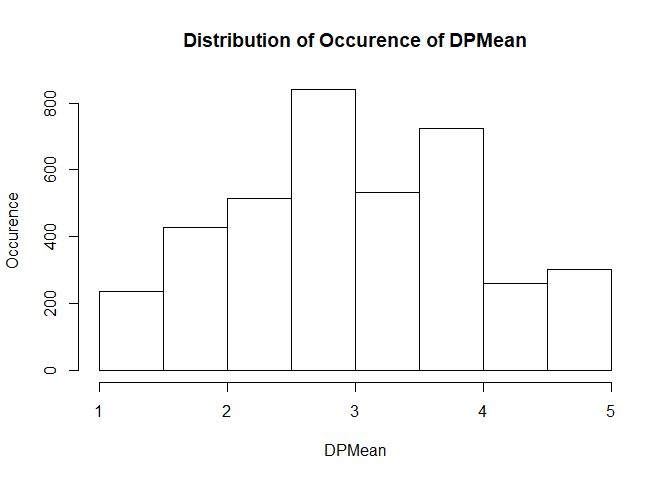<!-- -->

```r
hist(Merged_ProctransHumDev_DescripStats$GPMean, 
     xlab = "DPMean", ylab = "Occurence", 
     main = "Distribution of Occurence of GPMean")
```

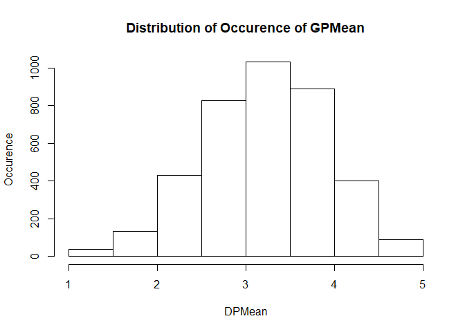<!-- -->

# Remove Unused Environment Variables

```r
rm(Merged_ProctransHumDev_DescripStats, ProctransHumDev_DescripStats)

Cnt_By_Gender <- as.data.frame(table(Merged_ProctransHumDev$Gender))
Cnt_By_Gender
```

```
##      Var1 Freq
## 1  Female 2194
## 2    Male 1645
## 3 Missing    5
```

```r
Cnt_By_WorkStatus <- as.data.frame(table(Merged_ProctransHumDev$WorkStatus))
Cnt_By_WorkStatus
```

```
##         Var1 Freq
## 1  full-time 2188
## 2    Missing   24
## 3  part-time  452
## 4    retired  161
## 5    student  779
## 6 unemployed  240
```

```r
Cnt_By_Curr_Occupation <- as.data.frame(table(Merged_ProctransHumDev$CurrOccption))
Cnt_By_Curr_Occupation %>%
  arrange(desc(Freq)) %>%
  head(30)
```

```
##                Var1 Freq
## 1           Missing 2499
## 2           Teacher   90
## 3           Manager   82
## 4         Professor   56
## 5          Attorney   54
## 6          Engineer   46
## 7          Director   43
## 8        Consultant   42
## 9            Writer   39
## 10    Administrator   28
## 11          Retired   28
## 12        Marketing   23
## 13          Student   22
## 14        Developer   21
## 15           Editor   21
## 16          Finance   21
## 17        Scientist   21
## 18       Programmer   19
## 19       Unemployed   18
## 20         houswife   16
## 21           Doctor   16
## 22            Nurse   14
## 23        Librarian   13
## 24           Artist   11
## 25       home maker   11
## 26       Technician   11
## 27 Graphic Designer   10
## 28           Server   10
## 29   Business Owner    9
## 30 Customer Service    9
```

```r
Cnt_By_CntryResdnc <- Merged_ProctransHumDev %>%
  group_by(CntryResdnc) %>% 
  do(data.frame(nrow=nrow(.))) %>%
  arrange(desc(nrow))

Cnt_By_CntryResdnc
```

```
## # A tibble: 81 x 2
## # Groups:   CntryResdnc [81]
##       CntryResdnc  nrow
##             <chr> <int>
##  1  United States  2785
##  2         Canada   243
##  3 United Kingdom   177
##  4      Australia    99
##  5          India    78
##  6          Italy    62
##  7        Germany    36
##  8         Brazil    20
##  9        Ireland    19
## 10    Netherlands    18
## # ... with 71 more rows
```

```r
Merged_ProctransHumDev %>%
  group_by(CnsdrSlfProc, OthCsndrProc) %>% 
  do(data.frame(nrow=nrow(.))) %>%
  arrange(desc(nrow)) %>%
  filter((CnsdrSlfProc == "yes" & OthCsndrProc == "yes") 
         | (CnsdrSlfProc == "no" & OthCsndrProc == "no"))
```

```
## # A tibble: 2 x 3
## # Groups:   CnsdrSlfProc, OthCsndrProc [2]
##   CnsdrSlfProc OthCsndrProc  nrow
##          <chr>        <chr> <int>
## 1          yes          yes  2253
## 2           no           no   458
```

```r
DP_Top15 <- aggregate(DPMean ~ CntryResdnc+HDI, Merged_ProctransHumDev, mean) %>%
  arrange(desc(DPMean)) %>%
  head(n=15)

ggplot(data = merge(Merged_ProctransHumDev, within(DP_Top15, rm("DPMean", "HDI")), by = "CntryResdnc")) +
  geom_bar(aes(x=reorder(CntryResdnc,DPMean,mean), DPMean, fill = HumDev_Categ),
           stat = "summary", fun.y = "mean", show.legend = T) + 
  xlab("Country") + ylab("DPMean") + 
  ggtitle("Top 15 Countries of DP Procrastination Mean Scale") + 
  theme(axis.text.x = element_text(hjust = 1)) +
  theme(plot.title = element_text(hjust = 0.5)) +
  coord_flip()
```

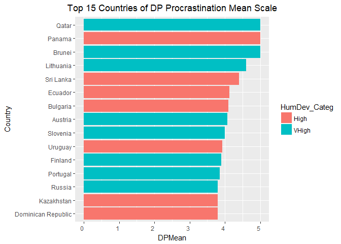<!-- -->

```r
GP_Top15 <- aggregate(GPMean ~ CntryResdnc+HDI, Merged_ProctransHumDev, mean) %>%
  arrange(desc(GPMean)) %>%
  head(n=15)

ggplot(data = merge(Merged_ProctransHumDev, within(GP_Top15, rm("GPMean", "HDI")), by = "CntryResdnc")) +
  geom_bar(aes(x=reorder(CntryResdnc,GPMean,mean), GPMean, fill = HumDev_Categ),
           stat = "summary", fun.y = "mean", show.legend = T) + 
  xlab("Country") + ylab("GPMean") + 
  ggtitle("Top 15 Countries of GP Procrastination Mean Scale") + 
  theme(axis.text.x = element_text(hjust = 1)) +
  theme(plot.title = element_text(hjust = 0.5)) + ylim(0,5) +
  coord_flip()
```

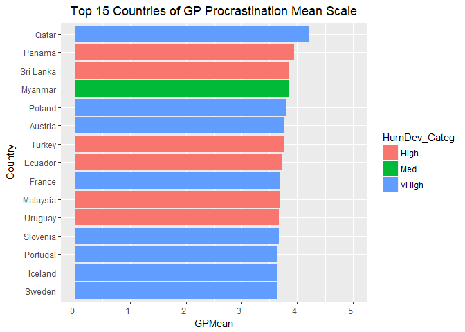<!-- -->

```r
GP_DP_Common_Cntry <- as.data.frame(intersect(DP_Top15$CntryResdnc, GP_Top15$CntryResdnc))
dim(as.data.frame(GP_DP_Common_Cntry))
```

```
## [1] 8 1
```

```r
names(GP_DP_Common_Cntry) <- c("CommonCntry")
GP_DP_Common_Cntry
```

```
##   CommonCntry
## 1      Panama
## 2       Qatar
## 3   Sri Lanka
## 4     Ecuador
## 5     Austria
## 6    Slovenia
## 7     Uruguay
## 8    Portugal
```

```r
plot(Merged_ProctransHumDev$Age, Merged_ProctransHumDev$AnnualIncome, 
     xlab="Age", ylab="Annual Income", 
     main="Age vs Annual Income", pch=2, cex.main=1.5, 
     frame.plot=FALSE, col=ifelse(Merged_ProctransHumDev$Gender=="Male", "red", "blue"))

legend("topleft", pch=c(2,2), col=c("red", "blue"), 
       c("Male", "Female"), bty="o",  box.col="darkgreen", cex=.8)
```

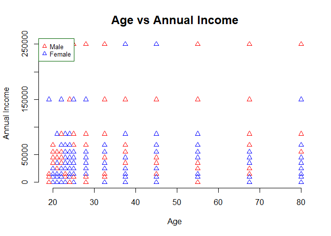<!-- -->

```r
ggplot(Merged_ProctransHumDev, aes(x=Age,y=AnnualIncome,color=Gender)) + 
  geom_point()+ geom_smooth(method = lm) + 
  xlab("Age") + ylab("Annual Income") + 
  ggtitle("Age vs Annual Income plot for all countries") +
  theme(plot.title = element_text(hjust = 0.5))
```

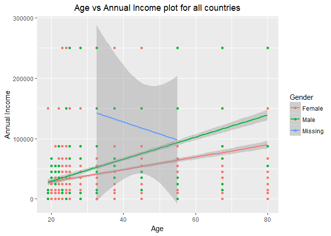<!-- -->

```r
ggplot(data = merge(Merged_ProctransHumDev, GP_DP_Common_Cntry, x.by = "CntryResdnc", y.by = "CommonCntry")) +
  aes(x=Age,y=AnnualIncome,color=Gender) + 
  geom_point()+ geom_smooth(method = lm) + 
  xlab("Age") + ylab("Annual Income") + 
  ggtitle("Age vs Annual Income plot for the 8 countries \ncommon between Top 15 DP and GP countries") +
  theme(plot.title = element_text(hjust = 0.5))
```

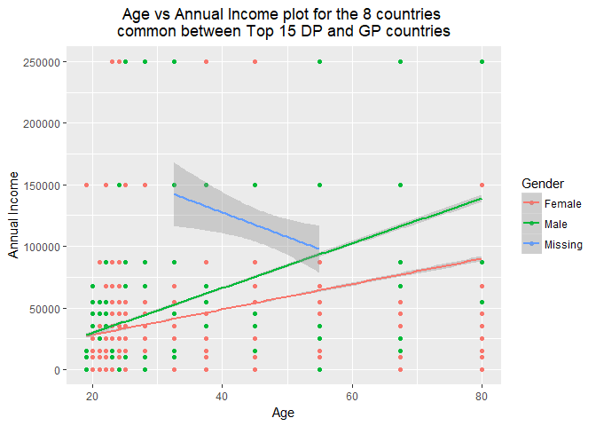<!-- -->

```r
plot(Merged_ProctransHumDev$SWLSMean, Merged_ProctransHumDev$HDI, 
     xlab="SWLSMean", ylab="HDI", ylim = c(0,1),
     main="SWLSMean vs HDI", pch=2, cex.main=1.5, 
     frame.plot=FALSE, col=ifelse(Merged_ProctransHumDev$Gender=="Male", "red", "blue"))
```

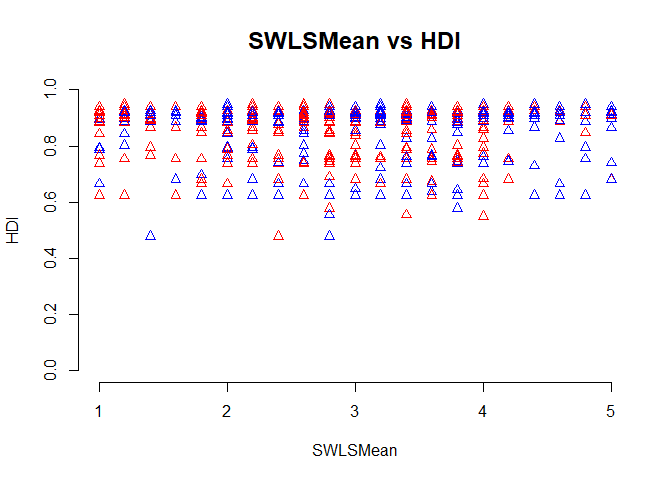<!-- -->

```r
ggplot(Merged_ProctransHumDev, aes(x=SWLSMean,y=HDI,color=Gender)) + 
  geom_point()+ geom_smooth(method = lm) + 
  xlab("HDI Category") + ylab("SWLSMean") + 
  ggtitle("Scatterplot of Mean Life Satisfaction by \nHuman Development Index Category by Gender") + 
  theme(axis.text.x = element_text(angle = 90, hjust = 1)) +
  theme(plot.title = element_text(hjust = 0.5))
```

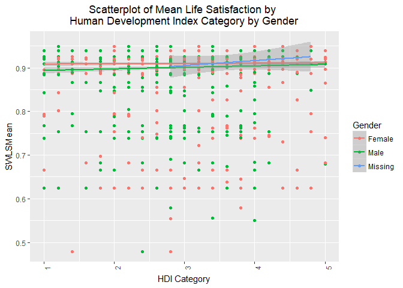<!-- -->

```r
ggplot(Merged_ProctransHumDev) +
  geom_bar(aes(x=reorder(HumDev_Categ,-SWLSMean,mean), SWLSMean, fill = HumDev_Categ),
           stat = "summary", fun.y = "mean", show.legend = T) + 
  xlab("HDI Category") + ylab("SWLSMean") + 
  ggtitle("Bar Chart of Mean Life Satisfaction by \nHuman Development Index Category") + 
  theme(axis.text.x = element_text(angle = 90, hjust = 1)) +
  theme(plot.title = element_text(hjust = 0.5))
```

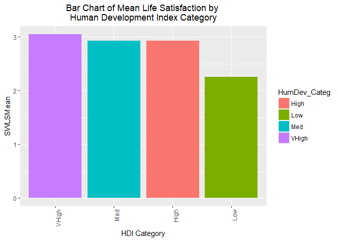<!-- -->

```r
LS_Top15 <- aggregate(SWLSMean ~ CntryResdnc+HDI, Merged_ProctransHumDev, mean) %>%
  arrange(desc(SWLSMean)) %>%
  head(n=15)

ggplot(data = merge(Merged_ProctransHumDev, within(LS_Top15, rm("SWLSMean", "HDI")), by = "CntryResdnc")) +
  geom_bar(aes(x=reorder(CntryResdnc,SWLSMean,mean), SWLSMean, fill = HumDev_Categ),
           stat = "summary", fun.y = "mean", show.legend = T) + 
  xlab("Country") + ylab("SWLSMean") + 
  ggtitle("Top 15 Countries of LS Procrastination Mean Scale") + 
  theme(axis.text.x = element_text(hjust = 1)) +
  theme(plot.title = element_text(hjust = 0.5)) + ylim(0,5) +
  coord_flip()
```

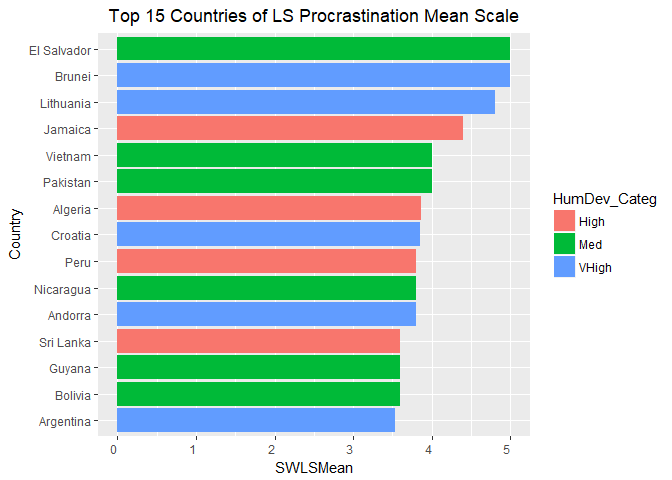<!-- -->

#Write the Human Development Data to CSV

```r
HumDevDataFile <- paste(DataDir, "HumanDevelopment.csv", sep = "/")
write.table(Total_HumDev,HumDevDataFile,row.names=F, col.names = T, sep = ",")
```

#Write the Cleaned Input Data with HDI to CSV

```r
CleanInputData_w_HDI_File <- paste(DataDir, "CleanedInput_w_HDI.csv", sep = "/")
write.table(Merged_ProctransHumDev,CleanInputData_w_HDI_File,row.names=F, col.names = T, sep = ",")
```

#Write the Human Development Data to CSV

```r
Top_15_DP <- paste(DataDir, "Top_15_DP_Cntry.csv", sep = "/")
write.table(DP_Top15, Top_15_DP,row.names=F, col.names = T, sep = ",")
```

#Write the Cleaned Input Data with HDI to CSV

```r
Top_15_GP <- paste(DataDir, "Top_15_GP_Cntry.csv", sep = "/")
write.table(GP_Top15, Top_15_GP,row.names=F, col.names = T, sep = ",")
```

# Remove Unused Environment Variables

```r
rm(Total_HumDev, Merged_ProctransHumDev, DP_Top15, GP_Top15, LS_Top15, GP_DP_Common_Cntry, 
   Cnt_By_CntryResdnc, Cnt_By_Curr_Occupation, Cnt_By_Gender, Cnt_By_WorkStatus, ProcTrans,
   ProcrastinationData, CleanInputData_w_HDI_File, HumDevDataFile, Top_15_DP, Top_15_GP)

rm(BaseDir, CodeDir, DataDir, HumDevUrl, PresenatationDir, ProcrastinationDataFile)
```
